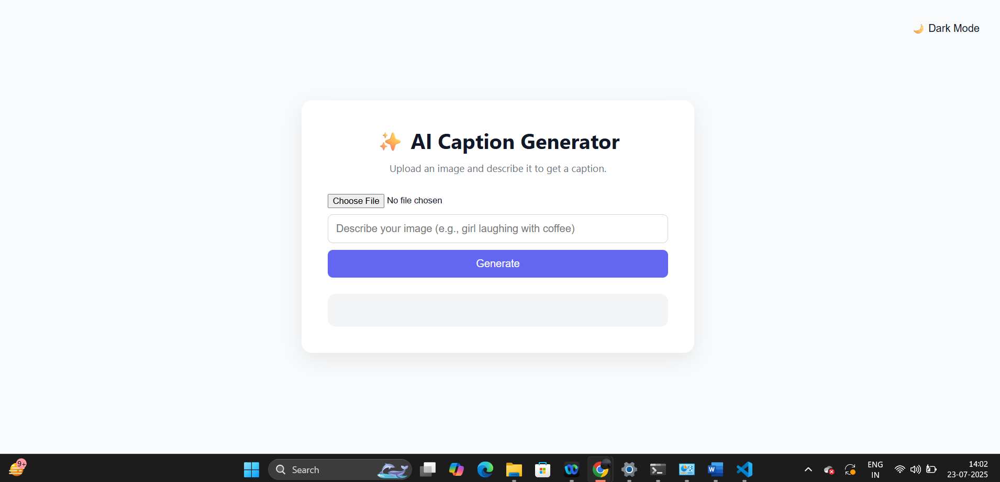
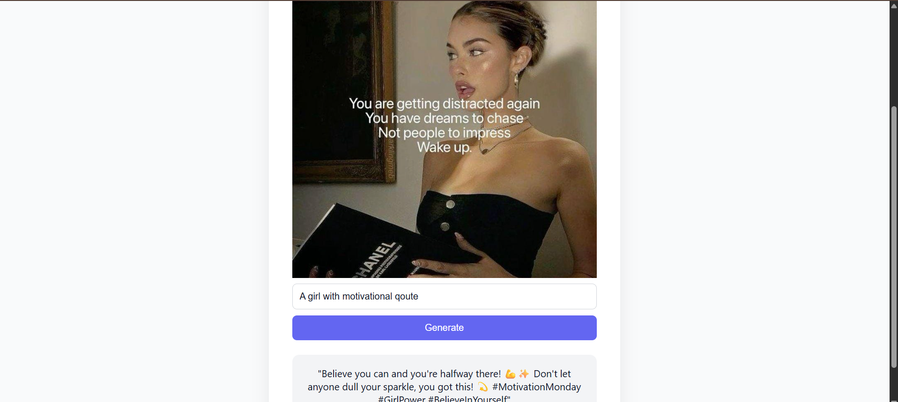
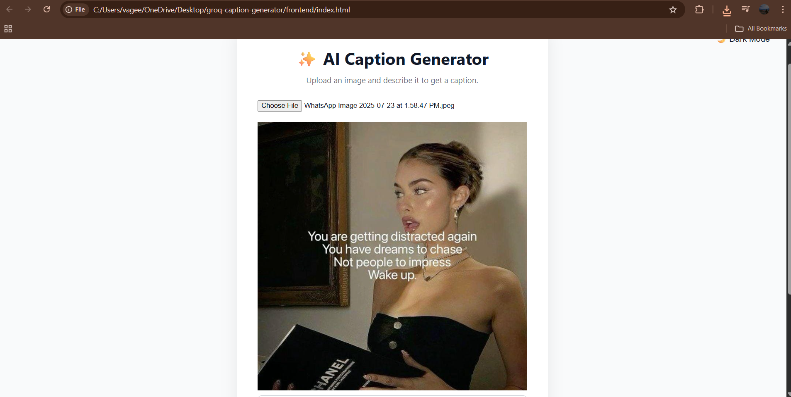

# 🧠 Groq Caption Generator

A modern, AI-powered tool to generate creative social media captions using [LLaMA 3 via Groq API].

## 🚀 Live Demo

👉 **Try it here**: [https://capgenai.netlify.app](https://capgenai.netlify.app)

## 🚀 Features

- 🎯 Generate captions based on text input
- 🖼️ Upload images to generate context-aware captions
- 🌗 Dark Mode toggle
- ⚡ Fast performance using Groq's ultra-low latency API

## 🛠 Tech Stack

- Frontend: HTML, CSS, JavaScript
- Backend: Python + Flask
- AI Model: LLaMA 3 via Groq API

## 📸 Screenshot

📬 Instructor
Gaurav Singh
